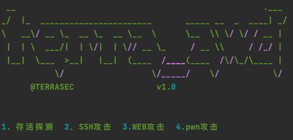

# AWD-WebKiller

适用AWD中WEB和PWN的各种场景下的攻击框架。
可快速修改exp进行批量攻击。

注：如果攻击目标为不同端口时，在target.txt中使用，ip:port格式，通常只用放ip地址即可

## 项目结构

├── README.md

├── conf.yaml

├── core

│   ├── common.py

│   └── data.py

├── lib

│   ├── admin.py //批量后台修改

│   ├── parseburplog.py

│   ├── pwn_exp.py //批量pwn攻击

│   ├── scan.py

│   ├── ssh.py //批量ssh修改密码

│   ├── submit_flag.py //批量提交flag

│   └── web_flag.py //批量获取flag

├── main.py

├── requirements.txt

└── web_targets.txt  //靶机清单

===========================================

如有疑问可提交issues或关注公众号联系我们

